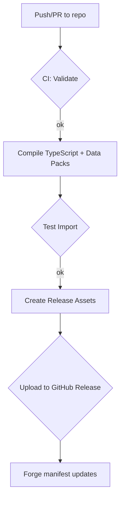

# Development Plan: Naruto-Themed PF2e Foundry Module

**Executive Summary:** Develop a data-driven Foundry VTT module (“PF2e-Naruto”) for Foundry V13 (PF2e v2.0) that injects custom Naruto-themed content (clans, jutsu, classes, etc.) via compendium packs. Using a TypeScript monorepo, we’ll source content as JSON/YAML and automate pack generation and publishing. Key deliverables include a well-structured repo (with compendium JSON templates for each PF2e entity), automated build/validation scripts (using Foundry’s CLI tools), a module manifest/config for The Forge, and a settings UI. Success means complete PF2e compliance (no manual UI entry) and seamless integration on The Forge with CI/CD pipelines (GitHub Actions) and a robust testing regimen.

## 1. Goals, Scope, and Constraints

- **Goals:** Provide a Naruto-adapted PF2e ruleset using Foundry’s data model (clans as ancestries, Specializations as classes, jutsu as spells, etc.), from level 1 (academy student) to 20 (Kage). Ensure PF2e balance and Foundry V13 compatibility. Use only canon content through Shippuden-era (extra custom content can be added later).  
- **Scope:** Implement all PF2e entity types needed: _Ancestries_ (“Clans”), _Heritages_ (“Clan Bloodlines”), _Backgrounds_ (villages/training), and their actions; _Classes_ (“Specializations”) and class features/actions; _Feats_ (general, village, and bloodline feats); _Spells_ (“Jutsu”) and their actions; _Equipment_ (tools, weapons); _Deities/Paths_; _Familiar and Companion_ abilities and features; plus all associated **Effects** (for feats, spells, gear, companions) to replicate Naruto mechanics. All content will live in compendium packs as JSON, not hardcoded or UI-entered.  
- **Constraints:** The module must be compatible with Foundry V13/PF2e v2 (as used on The Forge), use core PF2e systems (no system forking), and integrate with the PF2e Leveler module and the Forge hosting. We’ll use ES modules (per Foundry docs) and avoid unsupported hacks. Naruto themed “reskins” (e.g. chakra types as spell traits) must not break PF2e rules. We assume unspecified clan/heritage lists align with canon up to Shippuden but treat them as “TBD” in planning.  

## 2. High-Level Architecture

- **Monorepo Structure:** (see **Table 1** below for layout) Use a single GitHub repo with multiple directories for code and content. Key folders:  
  - `module.json`, `package.json`: Module manifest and npm config (with versioning)  
  - `src/`: TypeScript source (runtime hooks, settings UI, optional Jutsu Browser UI)  
  - `data/`: Raw data (JSON or YAML) for each entity type, organized by PF2e category (e.g. `data/ancestries/`, `data/classes/`, etc.)  
  - `packs/`: Generated compendium folders (LevelDB format) containing compiled data (excluded from VCS)  
  - `scripts/`: Build/automation scripts (pack compilation, validation)  
  - `lang/`: Localization JSON (i18n keys)  
  - `assets/`: Artwork and icons (optional)
  - `build/` or `dist/`: Bundled JS/CSS outputs.
  
  **Table 1: Proposed Repo Layout** (monorepo)  

  | Directory/File      | Purpose                                               |
  |---------------------|-------------------------------------------------------|
  | `module.json`       | Foundry module manifest (ID, version, pack map, etc.) |
  | `package.json`      | npm/TypeScript config, scripts, dependencies           |
  | `tsconfig.json`     | TypeScript config                                     |
  | `src/`             | TS code (runtime, UI, hooks)                          |
  | `scripts/`         | Build/CI scripts (pack build, validation, release)    |
  | `data/`            | Source content files (YAML/JSON for each entity type) |
  | `packs/`           | Compendium pack folders (Output, not in repo)         |
  | `lang/`            | Localization JSON files                               |
  | `assets/`          | Icons/artwork, templates                              |
  | `.github/workflows`| CI/CD (GitHub Actions) config                         |

- **Compendium Pack Mapping:**  We'll create one pack per entity group. Pack names follow PF2e convention (lowercase, underscores). For example:  
  - `shinobi.ancestries` (Clan list)  
  - `shinobi.ancestry-features` (clan-specific feats/features)  
  - `shinobi.backgrounds` (Academy, Village, etc.)  
  - `shinobi.background-actions`  
  - `shinobi.classes` (Specializations)  
  - `shinobi.class-features`  
  - `shinobi.class-actions`  
  - `shinobi.feats` (general feats, filler feat list)  
  - `shinobi.heritages` (Clan bloodlines)  
  - `shinobi.heritage-actions`  
  - `shinobi.spells` (“Jutsu”)  
  - `shinobi.spell-effects` (to support jutsu effects)  
  - `shinobi.equipment` (Shinobi tools like kunai)  
  - `shinobi.equipment-effects`  
  - `shinobi.deities` (Paths: e.g. Kage lineage)  
  - `shinobi.familiar-abilities` (companion actions)  
  - `shinobi.companion-ancestries` (animal companion types, akin to NPC races)  
  - `shinobi.companion-feats`, `shinobi.companion-abilities`, `shinobi.companion-adv-maneuvers`, `shinobi.companion-support`  
  - `shinobi.effects` (global effects if needed)  
  - **Pack Folders:** We may also define default compendium folder structures via `packFolders` in `module.json` for UI organization (e.g. group “Classes” > “Specializations”).  

  These packs will match PF2e’s data model: e.g. ancestries and classes are **Items** with `type: "ancestry"` or `"class"` etc. Each `module.json` pack entry must include `name`, `label`, `type` (`Actor` or `Item`), and `path`. For example, a pack entry looks like:  
  ```jsonc
  "packs": [
    {
      "name": "shinobi-ancestries",
      "label": "Shinobi Clans",
      "path": "packs/ancestries",
      "type": "Item",
      "system": "pf2e"
    },
    /* ...others... */
  ]
  ```  
  (See Foundry module docs for pack JSON schema【74†L253-L262】.)

- **Data-First Approach:** All content is authored in source files (JSON or YAML) under `data/`. Build scripts will convert these into Foundry compendium databases. We’ll use Foundry’s CLI (`@foundryvtt/foundryvtt-cli`) or similar tools for pack compilation (see [24]). E.g. `compilePack("data/ancestries", "packs/ancestries")` will build the LevelDB in `packs/ancestries` with item entries converted to PF2e format【24†L117-L124】. Build scripts will run on CI and as part of `npm run build`.  

## 3. Data Model & JSON Templates

We must map Shinobi concepts onto PF2e’s models. Below are templates for each entity type with required fields and examples. (We cite PF2e’s own JSON as references.) Each JSON example omits optional metadata for brevity (e.g. UUIDs, world/pack IDs).

### 3.1 Ancestries (Clans)

- **Type:** `type: "ancestry"` (an Item).  
- **Required Fields:** `name`, `type`, `img`, `system.size`, `system.speed`, `system.hp`, `system.traits.value` (array of trait strings like clan, subtype), `system.boosts` and `system.flaws` (PF2e ability boosts/flaws), `system.languages` (languages).  
- **Example (minimal):** 
  ```json
  {
    "name": "Uchiha Clan",
    "type": "ancestry",
    "img": "icons/clans/uchiha.webp",
    "system": {
      "size": "med",
      "speed": 25,
      "hp": 8,
      "languages": ["Common"],
      "traits": { "value": ["uchiha", "humanoid"], "rarity": "" },
      "boosts": { "value": ["dex", "cha"], "always": [] },
      "flaws": { "value": ["wis"], "always": [] }
    }
  }
  ```  
- **Example (full):** Includes description, alternate ability choices, etc:【33†L410-L418】  
  ```json
  {
    "name": "Hyūga Clan",
    "type": "ancestry",
    "img": "icons/clans/hyuga.webp",
    "system": {
      "size": "med",
      "speed": 25,
      "hp": 8,
      "languages": ["Common", "Hyūga"],
      "traits": { "value": ["hyūga", "humanoid"], "rarity": "common" },
      "vision": "lowLight",
      "boosts": { "value": ["dex", "wis"], "always": [] },
      "flaws": { "value": ["str"], "always": [] },
      "featLevels": { "value": [5, 9, 13, 17] },
      "description": { "value": "<p>The Hyūga Clan are...</p>" },
      "flavor": "<p>Bloodline of the Byakugan...</p>"
    }
  }
  ```  
- **PF2e Mapping:** Follows PF2e ancestry schema (size, speed, vision, traits, ability boosts/flaws)【33†L410-L418】. We’ll treat `traits.value` to include clan names (for filtering) and general tags (humanoid, ninja). Ability boosts/flaws can reflect clan stat trends. "Ancestry features" (like Byakugan) are separate Items in `shinobi.ancestry-features` pack.  

### 3.2 Heritage (Clan Bloodlines)

- **Type:** `type: "heritage"` (an Item). Heritages link to an ancestry.  
- **Required Fields:** `name`, `type`, `system.ancestry` (name/slug/UUID of clan item), `system.description`, optional `system.rules` for grant items, `system.traits`.  
- **Example:** Grant an item (e.g. Sharingan) via heritage rules【44†L382-L384】.  
  ```json
  {
    "name": "Uchiha Legacy",
    "type": "heritage",
    "img": "icons/heritages/uchiha_legacy.webp",
    "system": {
      "ancestry": { "name": "Uchiha Clan", "slug": "uchiha-clan", "uuid": "Compendium.shinobi-ancestries.uchiha-clan" },
      "traits": { "value": ["genjutsu", "dōjutsu"], "rarity": "common" },
      "description": { "value": "<p>You are of the Uchiha bloodline...</p>" },
      "rules": [
        { "key": "GrantItem", "uuid": "Compendium.shinobi.feats.Awakening-Sharingan" }
      ]
    }
  }
  ```  
- **Mapping:** See PF2e heritage JSON【44†L332-L344】. We’ll mirror structure: `ancestry.slug/uuid` links to clan, and `rules.GrantItem` grants feats (like clan-exclusive abilities). Traits tag the heritage.  

### 3.3 Backgrounds

- **Type:** `type: "background"`. Reflect character origin/village (e.g. “Leaf Ninja Academy”).  
- **Required Fields:** `name`, `type`, `system.skills` (array), `system.description`, `system.feats` (granted item IDs).  
- **Example:**  
  ```json
  {
    "name": "Konohagakure Academy",
    "type": "background",
    "img": "icons/backgrounds/academy.webp",
    "system": {
      "description": { "value": "<p>You trained at Konoha Academy...</p>" },
      "skills": ["acr", "lit"],
      "feats": { "value": ["Appraise"], "required": 0 }
    }
  }
  ```  
- **Background Actions:** If a background grants special actions, represent them as Items of type `action` in a `shinobi.background-actions` pack (PF2e often uses feats instead). Those would mirror PF2e “background actions” if any exist.  

### 3.4 Classes (Specializations)

- **Type:** `type: "class"`. Each specialization (e.g. “Genjutsu Specialist”, “Ninjutsu Healer”).  
- **Fields:** Mirrors PF2e classes【86†L738-L746】【88†L1197-L1204】: `system.hp`, `system.perception`, `system.attacks` (simple/martial/unarmed/have ranks), `system.defenses` (proficiency in armors), `system.classFeatLevels`, `system.generalFeatLevels`, `system.description`, and an `items` map referencing class feature Item UUIDs.  
- **Minimal Example:**  
  ```json
  {
    "name": "Genjutsu Specialist",
    "type": "class",
    "img": "icons/classes/genjutsu.webp",
    "system": {
      "description": { "value": "<p>You excel at illusionary jutsu.</p>" },
      "hp": 6,
      "perception": 2,
      "attacks": { "simple": 1, "martial": 0, "advanced": 0, "unarmed": 0 },
      "defenses": { "light": 1, "medium": 0, "heavy": 0, "unarmored": 1 },
      "classFeatLevels": { "value": [1,2,4,6,8,10,12,14,16,18,20] },
      "generalFeatLevels": { "value": [3,7,11,15,19] }
    }
  }
  ```  
- **Full Example:** Includes `items` listing class features (as per [86]) and `system.traits`.  
- **Mapping:** Follow PF2e class schema. The key is using PF2e’s proficiency slots (classFeatLevels etc.) to allow feats in build. Class-specific actions (e.g. specialized attacks) can be Items in `shinobi.class-features` or `shinobi.class-actions`.  

### 3.5 Class Features & Actions

- **Type:** Items of type `classfeature` (in pack `shinobi.class-features`). Also, any specialized actions can be type `action` in a `shinobi.class-actions` pack.  
- **Fields:** `classfeature` items include `system.description`, `system.rules` (RuleElements granting bonuses), etc. **Action** items follow PF2e actions schema【66†L332-L340】. For an action:  
  ```json
  {
    "name": "Shadow Clone Technique",
    "type": "action",
    "img": "icons/actions/shadow_clone.webp",
    "system": {
      "actionType": { "value": "action" },
      "actions": { "value": 2 },
      "category": "general",
      "description": { "value": "<p>Create illusory clones...</p>" },
      "traits": { "value": ["illusion", "conjuration"] }
    }
  }
  ```  
- **Mapping:** As PF2e `action` type (see PF2e Strike action【66†L332-L340】). Our actions use similar keys: `system.actions.value` (AP cost), `system.category`, `traits`, `description`. 
- *Compendium Linking:* Class items list their feature actions via UUIDs in `system.items`.  

### 3.6 Feats

- **Type:** `type: "feat"`. PF2e categories (ancestry, class, general, skill, etc.). For Shinobi, most feats will be general (e.g. cross-training, elemental affinity), village or clan (ancestry category).  
- **Fields:** `system.level`, `system.category` (ancestry/class/general), `system.prerequisites`, `system.description`, `system.traits` (like “fire”, “taijutsu”), `system.rules` if granting effects.  
- **Example (Minimal):**  
  ```json
  {
    "name": "Sharingan Awakening",
    "type": "feat",
    "img": "icons/feats/sharingan.webp",
    "system": {
      "level": 1,
      "category": "ancestry",
      "traits": { "value": ["dōjutsu", "genjutsu"] },
      "description": { "value": "<p>You awaken the Sharingan.</p>" },
      "rules": []
    }
  }
  ```  
- **Mapping:** Follows PF2e feat schema. Feats can use PF2e rule elements (`system.rules`) to provide bonuses (e.g. +skill). Required fields and structure consistent with PF2e (as in system’s feats packs).

### 3.7 Equipment (Gear & Weapons)

- **Type:** `type: "equipment"` (or subtype `weapon`/`armor`). Shinobi equipment like kunai, shuriken, ninja tools.  
- **Fields:** PF2e equipment fields: `system.price`, `system.bulk`, `system.equippedBulk`, `system.equipped`, `system.usage`, and if weapon: `system.damage`, `system.range`, `system.traits`.  
- **Example:**  
  ```json
  {
    "name": "Kunai",
    "type": "equipment",
    "img": "icons/equipment/weapons/kunai.webp",
    "system": {
      "description": { "value": "<p>A sharp throwing dagger.</p>" },
      "quantity": 1,
      "price": { "value": 2, "currency": "cp" },
      "bulk": 0.1,
      "traits": { "value": ["weapon", "thrown", "dagger"], "rarity": "common" }
    }
  }
  ```  
- **Actions:** Equipment actions (e.g. throwing a kunai) can be Items in `shinobi.equipment-actions` pack (likely type `action` with related traits).  
- **Mapping:** Follow PF2e’s weapon/equipment item schema. The module packaging guide [18] and PF2e source show equipment fields. 

### 3.8 Spells (Jutsu)

- **Type:** `type: "spell"`.  Shinobi jutsu are treated as spells.  
- **Fields:** PF2e spell fields: `system.level`, `system.school`, `system.actionType`, `system.actions`, `system.traits`, `system.duration`, `system.range`, `system.save`, `system.damageType`, etc.  
- **Example:**  
  ```json
  {
    "name": "Chidori",
    "type": "spell",
    "img": "icons/spells/chidori.webp",
    "system": {
      "level": 3,
      "school": "evocation",
      "casting": { "time": "action" },
      "traits": { "value": ["electricity", "attack"] },
      "description": { "value": "<p>A concentrated lightning strike...</p>" },
      "damage": { "value": "3d8", "type": "electricity" },
      "area": null,
      "target": "one creature",
      "range": { "value": 30, "units": "ft" }
    }
  }
  ```  
- **Spell Actions:** “Spell actions” may refer to innate action Items that cast the spell. However, PF2e treats spells themselves as cast via actions. We can optionally include Items of type `action` for jutsu for things like Quick Jutsu (bonus action manipulation).  
- **Mapping:** Use PF2e spell data model. Many fields optional, but include key ones (spell level, actions/AP cost, traits, effect). Effects (special damage, buffs) may be separate rule elements or `spell-effects`.  

### 3.9 Spell Effects

- **Type:** `type: "effect"` to represent ongoing effects of spells or abilities.  
- **Fields:** `system.duration`, `system.changes` (stat modifications), `system.flags`, etc. Examples in PF2e bestiary effects pack. We’ll create effects for techniques like buffs or persistent damage (e.g. immobilization effect of a genjutsu).  

### 3.10 Deities (Paths)

- **Type:** `type: "deity"`. Shinobi “deities” could be interpreted as ideology paths (e.g. Sage of Six Paths lineage).  
- **Fields:** Typically PF2e deities have no mechanics beyond lore; likely store alignment, domains (we might skip). Example just minimal:  
  ```json
  {
    "name": "Hagoromo Ōtsutsuki",
    "type": "deity",
    "img": "icons/deities/sage.webp",
    "system": {
      "alignment": ["ng"],
      "pantheon": "shinobi",
      "description": { "value": "<p>Ancestor of shinobi, known as Sage of Six Paths.</p>" }
    }
  }
  ```  
- **Mapping:** Use PF2e deity schema (alignments, domains, symbol, etc.).  

### 3.11 Familiar Abilities and Companions

- **Familiar Abilities (Type: `familiarAbility`):** Use PF2e familiar-abilities pack model. Example: akamaru’s special action.  
- **Animal Companion Ancestries/Feats (ACAnc, ACFeats):** PF2e uses Actor type for companions, but the *Compendium* lists “Ancestry Feats” for companions and “Companion Abilities”. For data-first, we create Items (type `feat` or `action`) for companion feats, and Items (type `familiarAbility`) for innate moves (following PF2e style).  
- **Advanced Maneuvers & Support Benefits:** PF2e companions have rules for maneuvers and support abilities (previews in PF2e system). We can mimic this by adding entries in packs `shinobi.companion-adv-maneuvers` and `shinobi.companion-support`. They would use custom item types (`advmaneuver`, `supportbenefit`), or simply as feats categorized accordingly.  
- **Example (AC Feat):** 
  ```json
  {
    "name": "Relentless Scent",
    "type": "feat",
    "img": "icons/abilities/senses/scent.webp",
    "system": {
      "category": "companion",
      "level": 1,
      "description": { "value": "<p>Your companion can track your scent...</p>" },
      "traits": { "value": ["trait1"] }
    }
  }
  ```  
- **Mapping:** Follow PF2e companion schema. (PF2e core has `familiar-abilities`, `feat-effects`, etc. We’ll treat them similarly.)

### 3.12 Effects (Equipment, Feat, Spell)

- **Type:** `type: "effect"`. Generic effects triggered by equipment, feats, or spells (e.g. buff, condition).  
- **Fields:** `duration`, `changes` (object), `alterations` (PF2e effects data model). For instance, a buff from a jutsu might be an effect with `changes: [{"key": "system.attributes.ac.bonus", "value": 2}]`.  
- **Mapping:** See PF2e bestiary effects (e.g. aging). We’ll populate as needed.  

### Summary Table of Entity Types and Packs

**Table 2: Compendium Pack Map** – key entity types to compendium packs:
| Pack Name (ID)            | Label                | PF2e Type(s)     | Notes                              |
|---------------------------|----------------------|------------------|------------------------------------|
| `shinobi.ancestries`       | Clans (Ancestries)   | Item, type=ancestry | Clans (Uchiha, Hyūga, etc.)       |
| `shinobi.ancestry-features`| Clan Feats          | Item, type=feat  | Abilities unique to each clan      |
| `shinobi.backgrounds`      | Backgrounds         | Item, type=background | Konoha Academy, etc.         |
| `shinobi.background-actions`| Background Actions | Item, type=action | Special moves from backgrounds    |
| `shinobi.classes`          | Specializations (Classes) | Item, type=class | Ninjutsu user, Taijutsu specialist, etc. |
| `shinobi.class-features`   | Class Features      | Item, type=classfeature | Class feat items like “Tailed Beast Affinity” |
| `shinobi.class-actions`    | Class Actions       | Item, type=action | E.g. specialized attacks         |
| `shinobi.feats`            | General Feats       | Item, type=feat  | Broad feats (village, ninja skills) |
| `shinobi.heritages`        | Bloodline Heritages | Item, type=heritage | Clan-specific bloodlines        |
| `shinobi.heritage-actions` | Heritage Actions    | Item, type=action | If heritage grants unique moves   |
| `shinobi.spells`           | Jutsu (Spells)      | Item, type=spell | All ninjutsu/genjutsu/etc.       |
| `shinobi.spell-actions`    | Spell Actions       | Item, type=action | If needed for e.g. Summoning     |
| `shinobi.spell-effects`    | Spell Effects       | Item, type=effect | Buffs/debuffs from jutsu         |
| `shinobi.equipment`        | Equipment & Weapons | Item, type=equipment | Kunai, scrolls, etc.           |
| `shinobi.equipment-actions`| Equipment Actions   | Item, type=action | E.g. Throw kunai, use scroll    |
| `shinobi.equipment-effects`| Equipment Effects   | Item, type=effect | Shuriken volley effect, etc.    |
| `shinobi.deities`          | Paths/Legends       | Item, type=deity | Kage lineages or Sage paths     |
| `shinobi.familiar-abilities`| Companion Abilities| Item, type=familiarAbility | Basic companion moves         |
| `shinobi.ac-ancestries`    | Companion Ancestries| Actor or Item? (NPC-type) | E.g. Canine, Ninken types    |
| `shinobi.ac-feats`         | Companion Feats     | Item, type=feat  | Animal companion feats          |
| `shinobi.ac-adv-maneuvers` | Companion Maneuvers | Item, type=action | Special companion maneuvers    |
| `shinobi.ac-support`       | Companion Support   | Item, type=feat  | Companion support benefits      |
| `shinobi.effects`          | Misc Effects        | Item, type=effect | Conditions, global effects     |

Each pack corresponds to a folder under `packs/`, defined in `module.json`【74†L253-L262】. Folder organization (packFolders) can further group them in the UI (optional).

## 4. Automation & Build Pipeline

### 4.1 Validation Scripts

- **JSON Schema / Type Checking:** Write scripts (Node/TS) to validate each JSON/YAML file against PF2e data model. We can use PF2e TypeScript definitions or JSON schemas if available. For example, use `ajv` to enforce required keys (name, type, system fields). This ensures no missing fields.  
- **Spell Check/Formatting:** Lint the descriptions and data (spell check, YAML lint).  

### 4.2 Pack Generation

- **Foundry CLI:** Use `@foundryvtt/foundryvtt-cli` (or `fvtt` global) to build packs:  
  ```bash
  fvtt package pack --manifest module.json
  ```  
  Or programmatically in `scripts/build-packs.js`:  
  ```js
  import { compilePack } from '@foundryvtt/foundryvtt-cli';
  // For each pack:
  compilePack("data/ancestries", "packs/ancestries");
  // etc.
  ```  
  This creates the LevelDB compendium folder from JSON data. (Foundry CLI docs show `compilePack(srcDir, destDir)`【24†L117-L124】.)  
- **Database Output:** The script runs after build to clear and re-create each `packs/...` folder.  

### 4.3 Manifest and Versioning

- **module.json:** Write with required fields. Include `compatibility: { minimum: "13", verified: "13" }`. Use Foundry’s example manifest structure【74†L253-L262】. List all packs under `"packs"`. Include `download` and `manifest` URLs for Forge (if doing self-updating). Version follows semantic versioning.  
- **Forge Deployment:** For Forge auto-update, host `module.json` on a stable raw URL (GitHub). Best practice: link manifest to `releases/latest/download/module.json` or raw on main branch【77†L22-L28】. For example:
  ```json
  "manifest": "https://github.com/yourorg/pf2e-shinobi/releases/latest/download/module.json",
  "download": "https://github.com/yourorg/pf2e-shinobi/releases/download/v1.0.0/shinobi-pf2e.zip"
  ```  
  We’ll use the recommended format (zip per version, not “latest”). The manifest JSON itself should be raw. Also increment `version` on every change to avoid Forge update issues【77†L22-L28】.

### 4.4 CI/CD (GitHub Actions)

**Pipeline Steps (see **Figure 1** below)**:  
1. **Lint/Validate:** On push/PR, run JSON/YAML validation and TS lint.  
2. **Build Compendia:** Run `npm run build` – compile TS and run `scripts/build-packs.js` to produce the `packs/` content.  
3. **Test Import:** Optionally run a headless Foundry import (using foundry-cli `import` command) to ensure packs load without error.  
4. **Package Release:** On a tagged release or `main` merge, bundle module (`build/` and `packs/`) into a zip.  
5. **Publish:** Upload release assets (module.zip, module.json). Possibly integrate with Forge’s update (using manifest URL from [77]).  

**CI Steps Table (Table 3):** Shows an example GitHub Actions workflow:  

| Step                   | Action                                            | Tools/Commands                              |
|------------------------|---------------------------------------------------|---------------------------------------------|
| Checkout code          | `actions/checkout@v3`                             |                                             |
| Setup Node             | `actions/setup-node@v3` (Node 18, Yarn)           |                                             |
| Install Dependencies   | `yarn install`                                    | Includes foundry CLI, validator libs        |
| Lint/Validate          | Run JSON/YAML linters (e.g. `yamllint`, `jsonschema`) and `npm run lint-ts` |                                             |
| Build (pack & compile) | `npm run build` → `tsc`, `scripts/build-packs.js` | foundryvtt-cli compilePack                  |
| Test (optional)        | `fvtt package import` for each pack to local DB   | (Headless Foundry test)                     |
| Package                | Zip `module.json`, `packs/`, `build/`             | `zip -r shinobi-pf2e.zip module.json packs build` |
| Release                | `actions/upload-release-asset` (on GitHub Release) | Attach module.zip and module.json           |
| Publish (Forge link)   | Ensure `module.json` hosted via raw GitHub link   |                                             |

**CI Flow Diagram (Figure 2):**  (Mermaid graph of steps)



## 5. Module Code & UI

### 5.1 TypeScript Structure

- **Entry Script:** `src/index.ts` registers module hooks (e.g. `Hooks.once('init', ...)`). Use ES modules (per manifest `esmodules`).  
- **Game Hooks:** On `ready` hook, register our custom rules if needed (PF2e system integration). Possibly use PF2e `RuleElement` classes if adding custom rule elements for Naruto mechanics (e.g. chakra usage).  
- **Settings UI:** In `src/settings.ts`, register any custom settings (e.g. toggles to enable/disable features). Use `game.settings.register("shinobi-pf2e", "settingName", {...})`. Provide a Settings Form (if multiple options) by subclassing `FormApplication` and adding to Module Configuration menu.  
- **Jutsu Browser (optional):** A custom UI panel to browse Jutsu. Could create a sidebar tab or a Chat button. Outline: A TS class extending `Application` to display a list of spells (jutsu) from compendium by trait. We can skip deep detail; just note possibility.  

### 5.2 API and Hooks

- **Hooks:** For any custom behavior (e.g. chakra regeneration each turn), use Foundry hooks. Possibly integrate with PF2e’s own effect application (`ActiveEffectPF2e`). Provide example hook usage (e.g. `Hooks.on('updateActor', ...)` if needed).  
- **Exposed API:** If other modules/plugins might interact, expose minimal API on `game.modules.get("shinobi-pf2e").api`. Document key functions (like a function to fetch all jutsu by category).  
- **Localization:** Include `lang/en.json` for all UI strings (names, descriptions). Use `game.i18n.localize("shinobi-pf2e.somestring")` in code/HTML.  

## 6. Migration & Updates

- **Content Patching:** For future additions (new clans or jutsu), simply add JSON to `data/` and rebuild packs. The structure supports iterative content expansion.  
- **Migration Strategy:** If changing entity schemas, use Foundry’s migration APIs (e.g. `MigrationRunner`) to update existing saved data. Version number in `module.json` should increment. Track any data migrations in `scripts/migrations/`.  
- **Versioning:** Use semantic versioning and update `module.json` each release. The wiki advises no two releases share a version【77†L7-L15】. The manifest `download` should reference a zip tied to that version to avoid Forge caching issues【77†L51-L58】.  

## 7. Testing Plan

- **Unit Tests:** Use a JS test framework (e.g. Jest) for data validation. For each JSON file, test that required fields exist and links (UUIDs) are well-formed.  
- **Integration Tests:** Automate a headless Foundry run on CI: import all compendium packs and attempt to create an actor with sample selections to catch errors. Foundry CLI can run script, or use `game.actors.create(...)` in a test scenario.  
- **Playtest Checklist:** Once loaded in Foundry: verify each clan grants the correct feats, jutsu behave as expected (via rule elements or macros), level progression works (PF2e Leveler compatibility). Check PF2e rule consistency (no broken math), and immersion (flavor). Involve a volunteer to create a Shinobi PC and report any rule/UI issues.  

## 8. Timeline and Milestones

Break the project into phases with rough effort estimates: small (S), medium (M), large (L). Refer to **Figure 2: Project Timeline** (mermaid chart) for an overview.

**Milestones:**  
1. **Infrastructure & Packs (L):** Set up repo, manifest, base `data/` structure. Implement compendium build scripts. (High effort: initial architecture)  
2. **Core Ancestries/Clans (M):** Create clan entries (Ancestries pack). Test import.  
3. **Basic Classes (M):** Add few specialization classes and features. Connect Leveler module slots.  
4. **Jutsu/Spells (L):** Add foundational jutsu (spells) and effects. Ensure spellcasting works.  
5. **Supporting Content (M):** Backgrounds, feats, equipment.  
6. **Companions (M):** Animal companion ancestries and abilities.  
7. **UI & Settings (S):** Build any needed UI (settings, UI improvements).  
8. **Testing & Balance (M):** Playtest, adjust stats.  
9. **Release Prep (M):** CI pipeline, Forge publishing (manifest, release zip).  

**Figure 2: Milestones Timeline (Gantt/Mermaid)**  
```mermaid
gantt
    title Naruto PF2e Module Development Timeline
    dateFormat  YYYY-MM-DD
    section Setup
    Project Planning            :done,    a1, 2026-01-01, 1w
    Repo/Monorepo Init         :done,    a2, after a1, 2w
    Script & Build Tools       :a3, 2026-01-15, 3w
    section Content Authoring
    Create Ancestries/Clans    :a4, after a3, 2w
    Develop Backgrounds        :a5, after a4, 1w
    Create Classes (Spec.)     :a6, after a5, 2w
    Add Class Feats/Actions    :a7, after a6, 1.5w
    Develop Jutsu/Spells       :a8, after a7, 3w
    Add Equipment/Tools        :a9, after a8, 1w
    Add Feats & Heritage       :a10, after a9, 2w
    Companion Features         :a11, after a10, 2w
    Deities/Paths              :a12, after a11, 1w
    section Automation & UI
    Create Settings UI         :a13, after a12, 1w
    CI/CD Pipeline (GitHub)    :a14, after a12, 1w
    section Testing & Release
    Unit/Integration Testing   :a15, after a14, 1w
    Playtesting (Balance)      :a16, after a15, 2w
    Documentation & Guides     :a17, parallel a16, 1w
    Final Review & Launch      :a18, after a16, 1w
```

**Estimated Effort (S/M/L):** Setup tasks like CI, packaging are **Medium** (requires careful config). Content creation (especially jutsu/spells) is **Large** (lot of data to create). Basic UI and settings are **Small**.

## Sources

Key references include Foundry’s module and packaging documentation【74†L253-L262】【72†L63-L72】, the PF2e system repository (for JSON schemas of ancestries, classes, etc. as shown in examples【33†L410-L418】【86†L738-L746】【66†L332-L340】), and the community wiki on best practices (manifest URL guidelines)【77†L22-L28】. These ensure our plan aligns with Foundry and PF2e conventions. 

